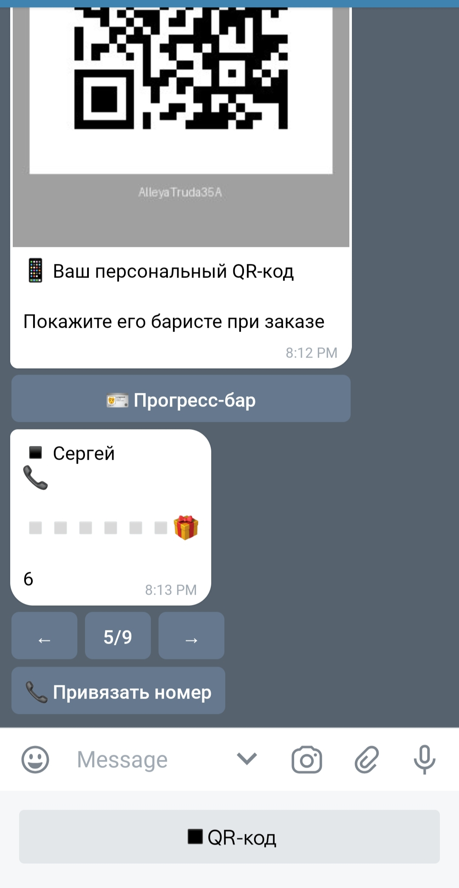
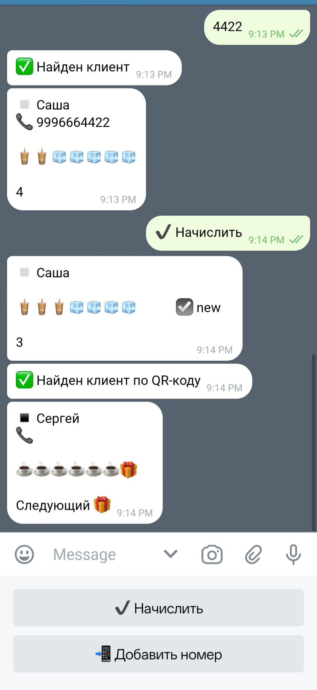
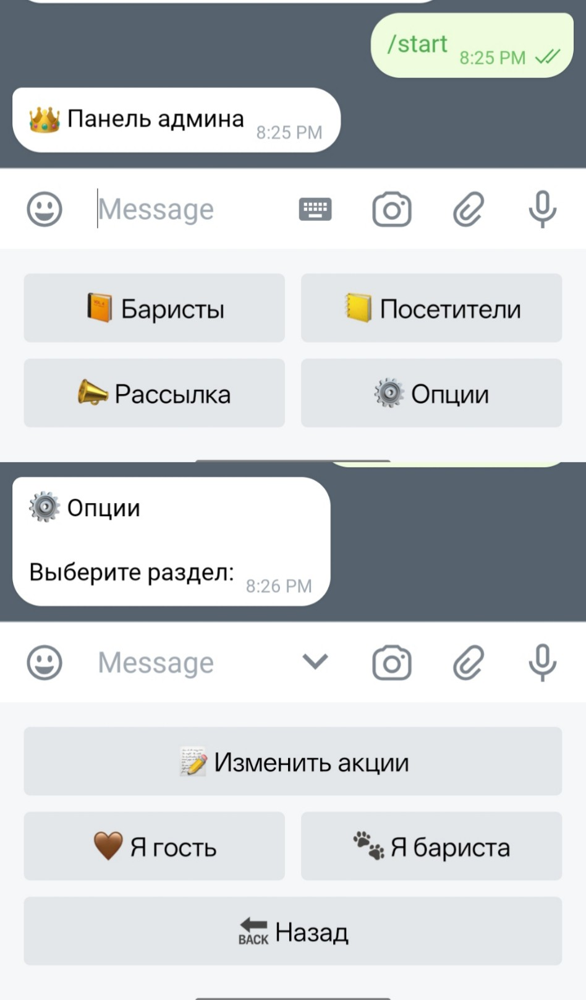

<<<<<<< HEAD
# Telegram-бот для акции «7-й кофе в подарок»

Оцифровка классической кофейной акции вместо картонных карточек с печатями.  
Бот — это счётчик покупок с базой данных.  
Разработан с нуля и **стабильно используется** в реальной кофейне (Приморский край, Большой Камень) с 2025 года.

## Что умеет

- Персональные QR-коды (генерация + распознавание фото)
- Прогресс-бар из эмодзи (9 стилей на выбор)
- Три роли: клиент / бариста / админ
- Начисление по QR или последним 4 цифрам телефона
- Уведомления со стикерами + авто-обнуление после 7-й покупки
- Админ-панель: баристы, пользователи, рассылка, бэкапы
- SQLite + ежедневные автоматические бэкапы

## Как работает (кратко)

Клиент получает QR-код и прогресс-бар.  
Бариста сканирует QR или вводит 4 цифры номера → +1 покупка → уведомление клиенту.  
Админ управляет всем: баристами (добавление/удаление), пользователями (список + правка карточек), рассылка, настройки акции.  
Может переключаться между ролями для тестирования.

Подробнее — команда /help для каждой роли.

## Скриншоты

| Клиент | Бариста | Админ |
|--------|---------|--------|
|  |  |  |

**Клиент:** QR-код и привязка номера • **Бариста:** поиск и начисление • **Админ:** главное меню и роли

## Технологии

- Python 3.11+
- python-telegram-bot v21.5
- SQLite
- QR: qrcode, pyzbar, opencv-python, Pillow
- python-dotenv

## Установка и запуск (локально)

1. Клонируйте репозиторий  
```bash
git clone https://github.com/plug-ink/Coffee_bot.git
cd Coffee_bot
```
2. Создайте виртуальное окружение
```bash
python -m venv venv
venv\Scripts\activate  # Windows
# source venv/bin/activate  # Linux/Mac
```
3. Установите зависимости
```bash
pip install -r requirements.txt
```
4. Создайте файл .env в корне
```bash
BOT_TOKEN=ваш_токен_бота
ADMIN_IDS=ваш_telegram_id    # или несколько через запятую: 123456789, 987654321
```   
5. Запустите
```bash
python bot.py
```
---
Проект стабильно работает в реальной кофейне — production-версия.  
Вопросы, предложения, форки — welcome в issues!  
Лицензия: MIT
=======
# CoffeeRina Bot ☕ — акция «7-й кофе в подарок»  

**Реальный проект в кофейне (Приморский край, Большой Камень).**  
Разработан с нуля, стабильно работает с 2025 года.

---

## 🎯 Суть проекта

Клиент покупает кофе — бариста сканирует QR (или вводит 4 цифры номера).  
Бот начисляет +1, на 7-й покупке — подарок 🎁.  
  
**Всё как на бумажных карточках, только в телефоне и без потери данных.**

---

## 📊 Самое важное — Google Sheets

Каждые 2 часа бот **сам выгружает статистику в Google Таблицу**.  
Владелец кофейни **не заходит в бота** — он просто открывает таблицу и видит:
- Кто сколько купил  
- Кому пора выдавать подарок  
- Сколько всего начислений  
- Когда клиент был в последний раз  
  
Таблица обновляется автоматически. Сервер, бот, база — всё в связке.

---

## 🔧 Что умеет бот

### 👤 Клиент
- Персональный QR-код
- Прогресс-бар из эмодзи (9 стилей)
- Привязка номера телефона
- Уведомления о начислениях

### 👨‍🍳 Бариста
- Сканирование QR из фото
- Поиск по последним 4 цифрам номера
- Начисление покупок
- Добавление новых клиентов

### 🛠 Админ
- Управление баристами
- Список всех клиентов
- Рассылки
- Настройка акции
- Резервное копирование БД

---

## 🖼 Скриншоты

| Клиент | Бариста | Админ |
|--------|---------|-------|
|  |  |  |

---

## 🛠 Технологии

- Python 3.11+
- python-telegram-bot 21.5
- SQLite
- Google Sheets API (gspread)
- QR: qrcode, pyzbar, opencv-python
- Systemd + schedule (автоэкспорт, автобэкапы)

---

## ⚙️ Быстрый старт 
```bash 
git clone https://github.com/plug-ink/Coffee_bot.git
cd Coffee_bot
python -m venv venv
venv\Scripts\activate # Windows
# source venv/bin/activate # Linux
pip install -r requirements.txt
```
Создайте `.env`: 
```bash 
BOT_TOKEN=ваш_токен
ADMIN_IDS=ваш_id
```
Запуск: 
```bash 
python bot.py
```
Для Google Sheets нужен service-account.json —
👉 Напишите мне в Telegram, пришлю инструкцию за 2 минуты.

## 📌 Чем я занимаюсь

Я **не делаю «ботов ради ботов»**.  
Я связываю Telegram и Google Sheets, чтобы бизнес перестал работать в Excel по email.

**Что я могу для вас сделать:**

✅ Любые заявки из Telegram → в Google Sheets  
✅ Учёт клиентов, визитов, накоплений  
✅ Внутренние админки для сотрудников  
✅ Автоматические отчёты в Telegram/таблицу  
✅ Перенос вашего Excel/бумаги в цифру

**Вам не нужно разбираться в коде.**  
Вы просто открываете таблицу и видите бизнес.

Telegram-бот — это просто интерфейс.
Сервер, база, автобэкапы, интеграции — это моя работа.

---

## 📬 Контакты
Проект открыт, форки приветствуются.
Готов обсудить доработку под ваши задачи.

[](https://github.com/plug-ink)  
[](https://t.me/plug_ink)  

⭐ Если проект полезен — поставьте звезду.  
📄 Лицензия: MIT — свободно используйте, модифицируйте, распространяйте.
>>>>>>> 48a853e (docs: update README and add Google Sheets)
