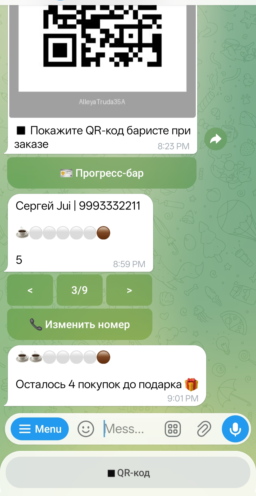
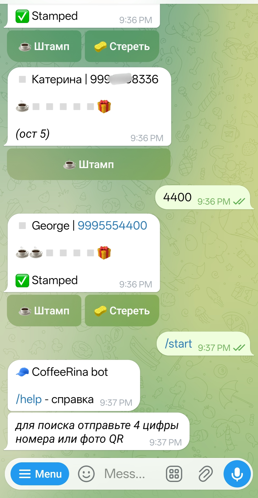
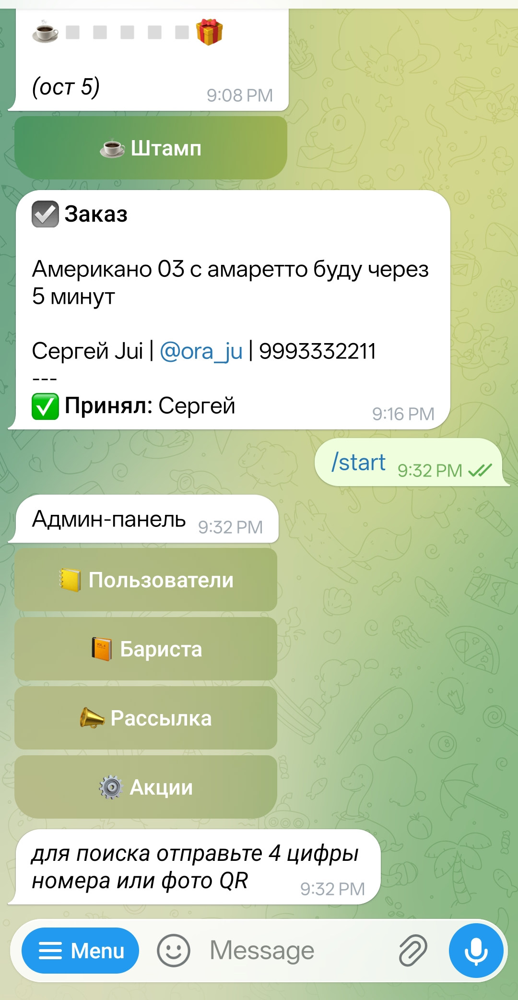

# CoffeeRina Bot

Telegram-бот для кофейни. Акция: каждый N-й напиток в подарок.

---

## Как работает

— Клиент берёт напиток, показывает свой QR или называет последние 4 цифры номера телефона
— Бариста находит карточку клиента и "ставит штамп"
— Бот сохраняет. На 7-й покупке подарок

---


| Клиент | Бариста | Админ |
|--------|---------|-------|
|  |  |  |

---

## Запуск

```bash 
git clone https://github.com/plug-ink/7thcoffee-bot.git
cd Coffee_bot
python -m venv venv
venv\Scripts\activate # Windows
# source venv/bin/activate # Linux
pip install -r requirements.txt
```
Создайте `.env`: 
```bash 
BOT_TOKEN=ваш_токен
ADMIN_IDS=ваш_id
```
Запуск: 
```bash 
python bot.py
```
Для Google Sheets нужен service-account.json

---

## Контактs

[](https://t.me/plug_ink)  

📄 Лицензия: MIT
